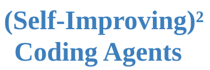
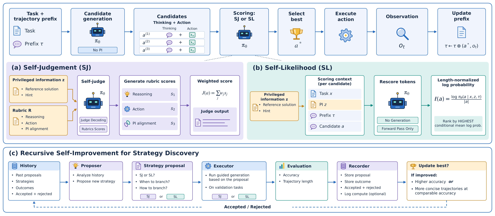

<h1 align="center">
  
  
</h1>

<br>

<p align="center">
  
  <a href="https://huggingface.co/datasets/Self-Improving-Coding-Agents/SI2CA-Training-Trajectories"></a>
  <a href="LICENSE"></a>
</p>

<p align="center">
  <a href="https://github.com/Self-Improving-Coding-Agents/SI2CA"><b>[💻 Repo]</b></a> •
  <a href="https://self-improving-coding-agents.github.io/SI2CA-Visualization/site/#qwen122b/swebench_pro_731/overview"><b>[🌐 Overview]</b></a> •
  <a href="https://self-improving-coding-agents.github.io/SI2CA-Visualization/site/#blog"><b>[📝 Blog]</b></a> •
  <a href="https://self-improving-coding-agents.github.io/SI2CA-Visualization/site/#qwen122b/swebench_pro_731/traj/self_judgement"><b>[🔍 Trajectory]</b></a> •
  <a href="https://huggingface.co/datasets/Self-Improving-Coding-Agents/SI2CA-Training-Trajectories"><b>[🤗 Data]</b></a> •
  <a href="https://github.com/Self-Improving-Coding-Agents/SI2CA/blob/main/reports/SI2CA-Technical-Report.pdf"><b>[📜 Report]</b></a>
</p>

<p align="center">
  Repo for <a href="https://github.com/Self-Improving-Coding-Agents/SI2CA/blob/main/reports/SI2CA-Technical-Report.pdf"><b>(Self-Improving)² Coding Agents: Curating High-Quality Trajectories via Recursive Self-Improvement</b></a>
</p>


## 🔥 News <a id="news"></a>

<div align="justify">

• [2026/09/11] SI2CA code and data are available for trajectory curation, evaluation, training.

</div>

---

https://github.com/user-attachments/assets/50659428-4177-4316-9a63-854044f07a74

## 💡 Introduction <a id="introduction"></a>

<div align="justify">

Through turn-level self-improvement, SI2CA curates accurate and concise coding-agent trajectories for training. The agent's own backend model selects candidate actions using Self-Judgement (SJ) or Self-Likelihood (SL). A recursive self-improvement (RSI) framework further refines when and how to branch to reduce curation cost.

</div>

<p align="center">
  <a href="data/method_editable.pdf"></a>
  <br>
  <em>Figure 1. (Self-Improving)² Coding Agents: two turn-level self-improvement strategies and a recursive self-improvement (RSI) framework for coding-agent trajectory curation.</em>
</p>

---

## 🚀 Quick Start <a id="quick-start-the-si2ca-package"></a>

### 📦 Conda <a id="conda"></a>

```bash
conda create --name si2ca --yes python=3.12 pip git
conda env config vars set --name si2ca PYTHONNOUSERSITE=1; conda activate si2ca
git clone --depth 1 --single-branch --branch main git@github.com:Self-Improving-Coding-Agents/SI2CA.git; cd SI2CA
python -m pip install --upgrade pip && python -m pip install '.[search]'

# Unpack and check the bundled benchmark files.
si2ca data prepare

python -m pip check  # Check installed dependency compatibility.
si2ca --help         # Show available commands and global options.
si2ca run --help     # Show experiment parameters and run options.
si2ca ls methods     # List supported methods and brief descriptions.
```

<div align="justify">

This environment supports API models and existing self-hosted endpoints. Benchmark execution also needs a running Docker-compatible daemon and the task images; `si2ca data prepare` unpacks bundled files but does not pull images or validate grading by execution.

For **model serving**, optionally install SGLang into the active environment from the checkout:

</div>

```bash
python -m pip install '.[search,serve]'
```

<div align="justify">

**PyPI publication is pending.** Use the checkout until the first release is published. GitHub Actions checks tests and packaging; publishing requires one-time PyPI authorization. See [Publishing](docs/PUBLISHING.md) for setup and releases.

</div>

### 🐳 Docker <a id="docker"></a>

<div align="justify">

We also recommend using Docker. Choose the GPU image to serve a model locally, or the lightweight client image to connect to an existing model service.

**Local GPU serving (NVIDIA):** use `Dockerfile.serve` with a compatible SGLang base image.

</div>

```bash
# Build the GPU image using your hardware-compatible SGLang image.
docker build -f Dockerfile.serve --build-arg SGLANG_IMAGE=YOUR_COMPATIBLE_SGLANG_IMAGE -t si2ca:0.2.6-gpu .

# Start SGLang on GPUs 0 and 1, then run SJ.
docker run --rm --gpus all --ipc=host --network host -v /var/run/docker.sock:/var/run/docker.sock -v "$PWD/runs:/work/runs" -v "$PWD/.cache:/cache" -e HF_HOME=/cache/huggingface -e HF_TOKEN si2ca:0.2.6-gpu run --method SJ --model Qwen/Qwen3.5-35B-A3B --gpu-ids 0,1 --out runs/docker_sj
```

<div align="justify">

**Existing GPU service or API:** use `Dockerfile`; model inference runs outside this container.

</div>

```bash
# Build the lightweight client image.
docker build -t si2ca:0.2.6-client .

# Run API-based SJ in Docker using the host daemon for task sandboxes (Linux).
docker run --rm --network host -v /var/run/docker.sock:/var/run/docker.sock -v "$PWD/runs:/work/runs" -v "$PWD/.cache/si2ca:/cache/si2ca" -e SI2CA_API_KEY si2ca:0.2.6-client run --method SJ --backend api --model Qwen/Qwen3.5-122B-A10B --base-url https://YOUR_API_HOST/v1 --out runs/docker_api_sj
```

### ⚡ One command: serve and run <a id="one-command-serve-and-run"></a>

```bash
# Run gold-guided SJ with an existing local checkpoint on GPUs 0 and 1.
si2ca run --method SJ --model Qwen/Qwen3.5-35B-A3B --model-path /path/to/Qwen3.5-35B-A3B --gpu-ids 0,1 --num-candidates 2 --judge-samples 3 --gold-patch --gold-weight 0.3

# Run hint-guided SL, reusing cached weights or downloading them before serving.
si2ca run --method SL --model Qwen/Qwen3.5-35B-A3B --gpu-ids 0,1 --pi hint --placement head --score likelihood
```

---
<br>


## 🗂️ Layout <a id="layout"></a>

```text
SI2CA/
├── configs/
│   └── experiments.yaml   # Named experiments and shared defaults
├── si2ca/                 # Python package and command-line interface
│   ├── cli.py             # Installed si2ca command
│   ├── run.py             # Shared configuration and experiment dispatch
│   ├── evaluate.py        # Shared evaluation dispatcher compatibility import
│   ├── prompts/           # Agent, SJ/SL, hint and tool prompt assets
│   ├── runtime/           # Harness, judges, likelihood, sandboxes and grading
│   ├── strategies/        # SL, likelihood gain and early-commitment strategy
│   ├── serve.py           # SGLang model serving
│   ├── results.py         # Result aggregation
│   └── search.py          # Search promotion rules
├── data/                  # Benchmark manifests, privileged inputs and grading assets
├── training/              # Pool preparation, trajectory cleaning, SFT and conversion
│   └── backend/           # Qwen3.5 SFT backend and shared framework dependencies
├── skills/                # RSI Proposer and Recorder skills
│   ├── Proposal.md
│   └── Recorder.md
├── docs/                  # Parameters, search-cycle guide and provenance
└── tests/                 # Offline checks; no model, GPU, container or paid API calls
```

Visualization and archived experiment records live in [SI2CA-Visualization](https://github.com/Self-Improving-Coding-Agents/SI2CA-Visualization).

---
<br>

### 🔌 SGLang Self-hosted or API Models <a id="sglang-self-hosted-or-api-models"></a><a id="model-files-and-sglang-compatibility"></a><a id="existing-self-hosted-or-api-model"></a>

<div align="justify">

SI2CA reuses local checkpoints or complete Hugging Face caches (e.g., [`Qwen/Qwen3.5-122B-A10B`](https://huggingface.co/Qwen/Qwen3.5-122B-A10B)) and downloads missing files automatically. Use `--model-path` for local weights, or `--base-url` to connect to an existing endpoint without downloading weights. Cache, revision, offline and parser options are documented in [Parameters](docs/PARAMETERS.md).

File resolution follows the [Hugging Face download/cache API](https://huggingface.co/docs/huggingface_hub/guides/download); parser options follow [SGLang server arguments](https://docs.sglang.ai/advanced_features/server_arguments.html).

</div>

```bash
# Run SJ against an existing self-hosted endpoint and save results to runs/sj.
si2ca run --method SJ --backend self-hosted --model Qwen/Qwen3.5-122B-A10B --base-url http://127.0.0.1:8151 --out runs/sj
```

<div align="justify">

For an API endpoint, switch to `--backend api` and use the provider's official model ID and base URL. Set `SI2CA_API_KEY` in the environment for authentication. API models support Standard and SJ; **SL is rejected for `--backend api`**, because it needs SGLang's native conditional log-likelihood forward. API requests omit local-only fields and, by default, temperature/top-p; use `--api-sampling` to include them.

</div>

### 🐍 Python API <a id="python-api"></a>

```python
from si2ca import run_experiment

run_experiment(
    method="SJ",
    backend="api",
    model="Qwen/Qwen3.5-122B-A10B",
    base_url="https://YOUR_API_HOST/v1",
    out="runs/python_sj",
    num_candidates=2,
    judge_samples=3,
    gold_weight=0.3,
)
```

---
<br>

## ⚖️ Standard and Self-Judgement <a id="standard-and-self-judgement"></a>

```bash
python -m si2ca.run --setting sj --benchmark both --model Qwen/Qwen3.5-122B-A10B --base-url http://127.0.0.1:8151 --out runs/qwen122_sj
```

<div align="justify">

Use a distinct `--out` for every setting/model/checkpoint. `--benchmark verified`, `pro`, and `both` select 500, 731 and 1,231 tasks. Pro includes the full public test split across Python, Go, JavaScript and TypeScript.

</div>

| Setting | Behavior | Experiment |
|---|---|---|
| `standard` | 1&nbsp;candidate;&nbsp;no&nbsp;judge | Main&nbsp;baseline |
| `sj` | 2&nbsp;candidates;&nbsp;3&nbsp;judge&nbsp;samples;&nbsp;judge&#8209;only&nbsp;gold | Main&nbsp;SJ&nbsp;/&nbsp;PI&nbsp;ablation |
| `sj_no_pi` | Intrinsic&nbsp;rubric;&nbsp;no&nbsp;gold&nbsp;or&nbsp;G1 | SJ&nbsp;without&nbsp;PI |
| `sj_strong` | Fixed&nbsp;policy;&nbsp;external&nbsp;judge;&nbsp;T=0.6,&nbsp;top&#8209;k=20 | Stronger&#8209;judge&nbsp;ablation |

<div align="justify">

Change the model and endpoint to run 35B or 122B. SJ recomputes weighted scores from rubric items, averages samples and selects the best candidate; it ignores the judge's self-reported total.

</div>

```bash
# Run Verified evaluation with an external judge.
python -m si2ca.run --setting sj_strong --benchmark verified --model Qwen/Qwen3.5-122B-A10B --base-url http://127.0.0.1:8151 --judge-model gpt-5.6-sol --judge-url http://127.0.0.1:8951/v1/chat/completions --out runs/qwen122_sol_judge
```

## 📐 Self-Likelihood <a id="self-likelihood-eight-settings"></a>

```bash
# Run SL with hints placed before the trajectory.
python -m si2ca.run --setting sl_hint_head --benchmark both --model Qwen/Qwen3.5-122B-A10B --base-url http://127.0.0.1:8151 --tokenizer-path /path/to/Qwen3.5-122B-A10B --out runs/qwen122_sl_hint_head
```

<div align="justify">

Replace the setting and output directory to run the full matrix on either model:

</div>

| Conditional likelihood | Likelihood gain | PI | Placement |
|---|---|---|---|
| `sl_gold_head` | `sl_gold_head_gain` | Gold patch | After problem, before trajectory |
| `sl_gold_tail` | `sl_gold_tail_gain` | Gold patch | After trajectory, before candidate |
| `sl_hint_head` | `sl_hint_head_gain` | Hint | After problem, before trajectory |
| `sl_hint_tail` | `sl_hint_tail_gain` | Hint | After trajectory, before candidate |

<div align="justify">

`python -m si2ca.make_hints --help` exposes hint generation for new tasks.

</div>

## 🧪 DeepSWE: Terra, judge effort, and Luna <a id="deepswe-terra-judge-effort-and-luna"></a>

<div align="left">

API access uses `SI2CA_API_KEY` and `SI2CA_JUDGE_API_KEY`; the Copilot shim uses `gh` authentication or `COPILOT_TOKEN`.

</div>

```bash
# Start the policy shim on port 8950 with xhigh reasoning.
python -m si2ca.responses_shim --model gpt-5.6-terra --effort xhigh --port 8950 --max-output-tokens 65536 --max-inflight 16

# In a separate terminal, start the judge shim on port 8951.
python -m si2ca.responses_shim --model gpt-5.6-terra --effort xhigh --port 8951 --max-output-tokens 4096 --max-inflight 16

# In another terminal, run the Terra Standard baseline on DeepSWE.
python -m si2ca.run --setting ds_standard --model gpt-5.6-terra --base-url http://127.0.0.1:8950 --out runs/terra_standard

# Run Terra SJ on DeepSWE with the separate judge endpoint.
python -m si2ca.run --setting ds_sj --model gpt-5.6-terra --base-url http://127.0.0.1:8950 --judge-model gpt-5.6-terra --judge-url http://127.0.0.1:8951/v1/chat/completions --out runs/terra_sj
```

---
<br>

## 🔄 Recursive Self-Improvement (RSI) Cycles <a id="recursive-search-cycles"></a>

<div align="justify">

**RSI cycles use 192 tasks from the SWE-bench Multilingual benchmark**, supplied as `data/dev192_multilingual.jsonl`. The [per-task CSV](data/dev192_multilingual_manifest.csv) records difficulty, patch statistics and repository.

</div>

The discovered **early-commitment window** strategy uses self-judgement from the first observation through the third mutation-like command, then follows one candidate. Adjust `--branch-until-edit` (default 3) to change this window; it counts mutation-like commands, not exact filesystem edits.

```bash
# Evaluate the discovered early-commitment window strategy on 192 Multilingual tasks.
si2ca run --method Discovered --benchmark validation --model Qwen/Qwen3.5-122B-A10B --base-url http://127.0.0.1:8151 --branch-until-edit 3 --out runs/search_early_commit
```

<div align="justify">

The search interface is `Strategy.plan(ctx)` and `Strategy.select(ctx, candidates, judge)`. New candidate files can be evaluated with `python -m si2ca.runtime.strategy --strategy /path/to/strategy.py ...`, matching the dataset and generation settings; use `--scaffold SJ` for self-judgement or `--scaffold SL` for self-likelihood. Gold is included for all 192 tasks. Hints for additional tasks must be prepared before hint-based SL search. On `--benchmark validation`, `standard` and `sj` also use the strategy runner and the Multilingual grader, so they can serve as comparable search baselines.

</div>

### 🧩 Proposer and Recorder skills <a id="proposer-and-recorder-skills"></a>

<div align="justify">

Both roles are included in the repository and Python package:

• **[Proposal](skills/Proposal.md):** reads anonymized history and traces, then writes one candidate strategy, offline tests and `pending_eval.json`.

• **[Recorder](skills/Recorder.md):** reviews measured results and contrastive traces, writes `history/entries/cycle_NNN.md` and appends `history/POOL.md`.

</div>

<div align="justify">

The workflow is **proposer → operator-run evaluation → recorder**; repeat using the selected incumbent and updated history. SI2CA provides the skills, evaluator and promotion comparison, but does not automatically launch agents or consume `pending_eval.json`. See the [one-cycle guide](docs/SEARCH.md) for inputs, commands and handoffs.

Strategies must not branch on task identity or write PI/judge feedback into policy context. After reviewing those constraints, compare the completed runs:

</div>

```bash
# Compare candidate and incumbent results after a successful context audit.
python -m si2ca.search --incumbent runs/incumbent/results.json --candidate runs/candidate/results.json --context-audit-passed
```

<div align="justify">

Promotion requires 7 additional solved tasks, or at most 2 fewer tasks with retained-path tokens/turns ≤0.9× the incumbent inside the accuracy margin.

</div>

---
<br>


## 🧬 Trajectory curation and SFT <a id="trajectory-curation-and-sft"></a>

<div align="justify">

The three trajectory sets used for the SFT experiments in the paper (`standard`, `full_self_judgement` and `discovered_strategy`, all generated by Qwen3.5-122B-A10B) are released as the Hugging Face dataset [SI2CA-Training-Trajectories](https://huggingface.co/datasets/Self-Improving-Coding-Agents/SI2CA-Training-Trajectories). The steps below reproduce their curation.

**1.** Prepare a separate training JSONL with images, grading commands and gold. Use `training/build_pool.py` to build the pool; its source datasets and execution evidence are external inputs:

</div>

```bash
python training/build_pool.py --input-root /path/to/source_training_data --out-dir training/data/pool
```

<div align="justify">

**2.** With the same 122B policy and training pool, run `standard`, `sj`, and `discovered`, passing `--dataset training/data/pool.jsonl` and separate output directories.

**3.** Export selected policy trajectories:

</div>

```bash
python training/prepare.py --traj-dir runs/curation_sj/traj --tokenizer /path/to/Qwen3.5-35B-A3B-Base --out training/data/sj.jsonl
```

<div align="justify">

Repeat for all arms. Keep solved and unsolved clean exits; drop malformed calls and sequences over 131,072 tokens; use the original `qwen3_5` assistant-token mask. The audit lists retained IDs and rejection reasons. For paired arms, intersect their retained IDs and re-export with `--task-ids common_ids.txt`.

**4.** In a compatible Megatron/ROCm environment, convert the Base checkpoint:

</div>

```bash
export MEGATRON_PATH=/path/to/Megatron-LM
export PYTHONPATH="$PWD/training/backend:$MEGATRON_PATH:${PYTHONPATH:-}"
source training/model.sh
python training/backend/tools/convert_hf_to_torch_dist.py "${MODEL_ARGS[@]}" --hf-checkpoint /path/to/Qwen3.5-35B-A3B-Base --save /path/to/Base_torch_dist --use-cpu-initialization --bf16
```

<div align="justify">

**5.** Train each arm from the same Base checkpoint:

</div>

```bash
# Train the SJ student.
SFT_DATA="$PWD/training/data/sj.jsonl" STUDENT_HF=/path/to/Qwen3.5-35B-A3B-Base STUDENT_REF=/path/to/Base_torch_dist SAVE_DIR=/path/to/checkpoints/sj MEGATRON_PATH=/path/to/Megatron-LM bash training/sft.sh
```

<div align="justify">

Set `RESUME=1` explicitly to resume. Recipe: eight MI300X GPUs, TP2/CP4/EP8, bf16, two epochs, batch 32, AdamW, cosine LR 5e-6→5e-7, warmup 3%, sequence length 131,072. Checkpoints are not automatically deleted.

**6.** Export the selected checkpoint, serve it, and run `sft_eval` with one candidate:

</div>

```bash
# Export the selected trained checkpoint to Hugging Face format.
python training/backend/tools/convert_torch_dist_to_hf.py --input-dir /path/to/checkpoints/sj/iter_0000673 --output-dir /path/to/exported_sj --origin-hf-dir /path/to/Qwen3.5-35B-A3B-Base --add-missing-from-origin-hf

# Verify and finalize the exported model's stop-token configuration.
python training/finalize_export.py /path/to/exported_sj

# Run student evaluation on Verified and the full Pro public test split.
python -m si2ca.run --setting sft_eval --benchmark both --model /path/to/exported_sj --base-url http://127.0.0.1:8151 --out runs/student_sj
```

---
<br>

## 📊 Results <a id="results"></a>

SJ uses k=2, 3 judge samples and gold weight 0.3; SL uses k=4. 

### SWE-bench Verified — 500 tasks <a id="swe-bench-verified--500-tasks"></a>

| Model | Strategy | Resolve rate (%) | Mean turns | Median turns | P90 turns |
|---|---|---:|---:|---:|---:|
| Qwen3.5-35B-A3B | Standard | 65.8 | 85.0 | 76 | 144 |
| Qwen3.5-35B-A3B | Self-judgement | $`70.0\,\color{green}{(\uparrow 4.2)}`$ | $`73.7\,\color{green}{(\downarrow 11.3)}`$ | $`67\,\color{green}{(\downarrow 9)}`$ | $`127\,\color{green}{(\downarrow 17)}`$ |
| Qwen3.5-35B-A3B | Self-likelihood | $`66.8\,\color{green}{(\uparrow 1.0)}`$ | $`76.9\,\color{green}{(\downarrow 8.1)}`$ | $`68\,\color{green}{(\downarrow 8)}`$ | $`130\,\color{green}{(\downarrow 14)}`$ |
| Qwen3.5-122B-A10B | Standard | 67.0 | 72.1 | 64 | 122 |
| Qwen3.5-122B-A10B | Self-judgement | $`71.0\,\color{green}{(\uparrow 4.0)}`$ | $`68.8\,\color{green}{(\downarrow 3.3)}`$ | $`61\,\color{green}{(\downarrow 3)}`$ | $`116\,\color{green}{(\downarrow 6)}`$ |
| Qwen3.5-122B-A10B | Self-likelihood | $`69.8\,\color{green}{(\uparrow 2.8)}`$ | $`69.5\,\color{green}{(\downarrow 2.6)}`$ | $`62\,\color{green}{(\downarrow 2)}`$ | $`118\,\color{green}{(\downarrow 4)}`$ |

### SWE-bench Pro — 731 tasks <a id="swe-bench-pro--731-tasks"></a>

| Model | Strategy | Resolve rate (%) | Mean turns | Median turns | P90 turns |
|---|---|---:|---:|---:|---:|
| Qwen3.5-35B-A3B | Standard | 46.0 | 89.4 | 80 | 153 |
| Qwen3.5-35B-A3B | Self-judgement | $`53.2\,\color{green}{(\uparrow 7.2)}`$ | $`79.3\,\color{green}{(\downarrow 10.1)}`$ | $`72\,\color{green}{(\downarrow 8)}`$ | $`133\,\color{green}{(\downarrow 20)}`$ |
| Qwen3.5-35B-A3B | Self-likelihood | $`51.2\,\color{green}{(\uparrow 5.2)}`$ | $`77.5\,\color{green}{(\downarrow 11.9)}`$ | $`68\,\color{green}{(\downarrow 12)}`$ | $`134\,\color{green}{(\downarrow 19)}`$ |
| Qwen3.5-122B-A10B | Standard | 48.0 | 84.6 | 80 | 135 |
| Qwen3.5-122B-A10B | Self-judgement | $`58.5\,\color{green}{(\uparrow 10.5)}`$ | $`80.2\,\color{green}{(\downarrow 4.4)}`$ | $`74\,\color{green}{(\downarrow 6)}`$ | $`130\,\color{green}{(\downarrow 5)}`$ |
| Qwen3.5-122B-A10B | Self-likelihood | $`53.8\,\color{green}{(\uparrow 5.8)}`$ | $`69.9\,\color{green}{(\downarrow 14.7)}`$ | $`64\,\color{green}{(\downarrow 16)}`$ | $`117\,\color{green}{(\downarrow 18)}`$ |

### DeepSWE — 113 tasks <a id="deepswe--113-tasks"></a>

| Model | Strategy&nbsp;/&nbsp;judge&nbsp;effort | Resolve&nbsp;rate&nbsp;(%) | Mean&nbsp;turns | Median&nbsp;turns | P90&nbsp;turns | Independent&nbsp;runs |
|---|---|---:|---:|---:|---:|---:|
| GPT&#8209;5.6&#8209;Luna&#8209;Max | Standard | 60.2 | 246.8 | 173 | 465 | 1 |
| GPT&#8209;5.6&#8209;Luna&#8209;Max | Self&#8209;judgement | $`64.6\,\color{green}{(\uparrow 4.4)}`$ | $`223.0\,\color{green}{(\downarrow 23.8)}`$ | $`150\,\color{green}{(\downarrow 23)}`$ | $`474\,\color{red}{(\uparrow 9)}`$ | 1 |
| GPT&#8209;5.6&#8209;Terra&#8209;xHigh | Standard | 64.4 ± 2.0 | 59.3 | 52 | 98 | 4 |
| GPT&#8209;5.6&#8209;Terra&#8209;xHigh | SJ,&nbsp;judge=xHigh | $`67.5 \pm 2.5\,\color{green}{(\uparrow 3.1)}`$ | $`52.3\,\color{green}{(\downarrow 7.0)}`$ | $`46\,\color{green}{(\downarrow 6)}`$ | $`86\,\color{green}{(\downarrow 12)}`$ | 4 |

<div align="justify">

Paper Table 2, evaluated on the full DeepSWE v1.1 benchmark. Terra averages four independent runs (± sample standard deviation); Luna uses one run. The drivers use k=2, two judge samples and a 1,000-turn limit.

</div>

---
<br>

## 📝 Citation <a id="citation"></a>

```bibtex
@misc{liang2026si2ca,
  author = {{SI2CA Contributors}},
  title  = {{(Self-Improving)$^2$ Coding Agents: Curating High-Quality Trajectories via Recursive Self-Improvement}},
  year   = {2026},
  url    = {https://github.com/Self-Improving-Coding-Agents/SI2CA}
}
```

<div align="justify">

Machine-readable citation metadata is available in [CITATION.cff](CITATION.cff).

</div>

## ⭐ Star History <a id="star-history"></a>

<a href="https://www.star-history.com/?repos=Self-Improving-Coding-Agents%2FSI2CA&amp;type=date">
  <picture>
    <source media="(prefers-color-scheme: dark)" srcset="https://api.star-history.com/svg?repos=Self-Improving-Coding-Agents%2FSI2CA&amp;type=date&amp;theme=dark" />
    
  </picture>
</a>

<div align="justify">

The chart tracks repository-wide stars and will populate once [Star History](https://www.star-history.com/blog/how-to-use-github-star-history/) can access this repository's star data.

</div>
